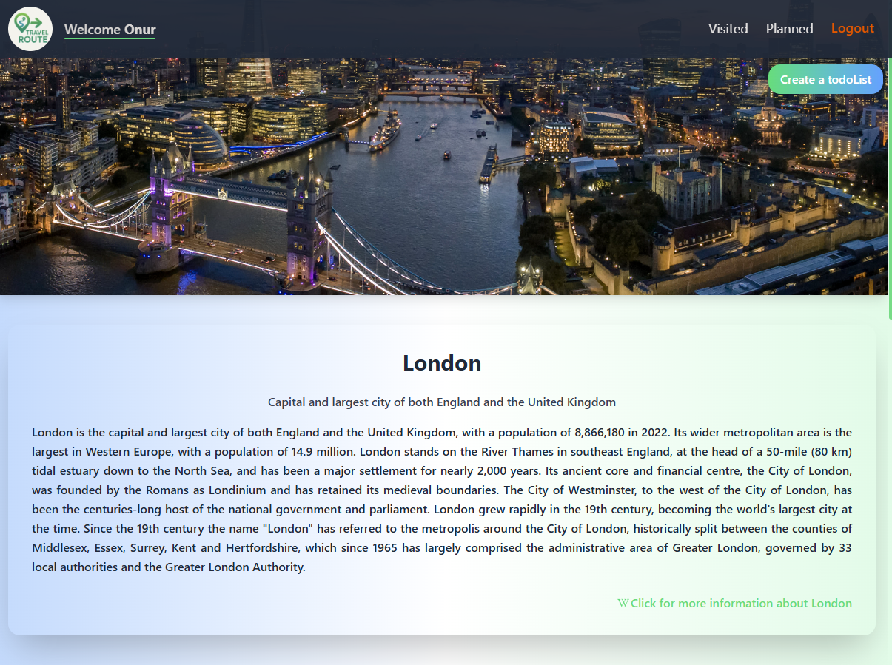

# React + TypeScript + Vite

🚀 **Travel Route** — A fully responsive travel planning app...

A fully responsive travel planning app built with React, Vite, and TypeScript. Plan your trips by adding cities on an interactive map, manage to-dos, favorite your places, and track your travel history — all with user authentication powered by JSON Server.

🎯 **Key Features**

🗺️ **Interactive Map**:
Add cities as visited or planned by simply selecting locations on the map using Leaflet and React Leaflet.

🔍 **Instant Search**:
Search cities or countries, and the map smoothly zooms to your location with an automatic city info form popping up.

📍 **Country View & Geolocation**:
View countries individually and find your current position with a single click.

🏙️ **Detailed City & Tourist Spots**:
Access comprehensive descriptions and highlight top attractions for every city.

✅ **To-Do Lists & Trip Progress**:
Create, edit, and mark tasks for tourist spots. Completed trips automatically move to your visited list.

⭐ **Favorites & Filtering**:
Easily mark cities as favorites and filter your visited list to focus on your top destinations.

📱 **Responsive Design**:
Clean and modern UI powered by Tailwind CSS, ensuring smooth use on all device sizes.

🛠️ Robust State Management:
Managed with Redux Toolkit and persisted using redux-persist to save your app state.

📝 Effortless Forms:
All forms are handled seamlessly with React Hook Form, ensuring smooth validation and UX.

👤 User Authentication:
Register and log in with JSON Server acting as a mock backend API for storing user data securely.

🔔 User Notifications:
Real-time toast notifications powered by React Hot Toast keep you informed of all actions.

🛠️ **Technologies & Dependencies**

- React & React DOM Core UI library v19.0.0-rc.1
- Vite Next-gen frontend tooling Latest
- TypeScript Typed JavaScript Latest
- Redux Toolkit & React Redux State management ^2.8.2 / ^9.2.0
- Redux-persist Persist Redux state between sessions ^6.0.0
- React Router DOM Client-side routing ^7.6.0
- Axios HTTP requests ^1.9.0
- JSON Server Mock backend API ^1.0.0-beta.3
- Leaflet & React Leaflet Interactive maps ^1.9.4 / ^5.0.0
- React Datepicker Date selection component ^8.3.0
- Tailwind CSS & @tailwindcss/vite plugin Utility-first CSS framework ^4.1.7
- React Hook Form Form management ^7.56.4
- React Icons Icon library ^5.5.0
- React Hot Toast Notification system ^2.5.2

⚡ Getting Started
Prerequisites
Node.js (v16+ recommended)

npm or yarn

Installation

# Clone the repository

git clone https://github.com/Onuryemez54/Travel-Route-App.git
cd travel-route

# Install dependencies

npm install

# or

yarn install

# Running the Project

# Start JSON Server (mock API backend)

bash

npm run json-server

# Start development server (Vite)

npm run dev

📬 **Contact**

Created by Onur Yemez.
Feel free to reach out!
🔗 [GitHub Profile](https://github.com/Onuryemez54)
